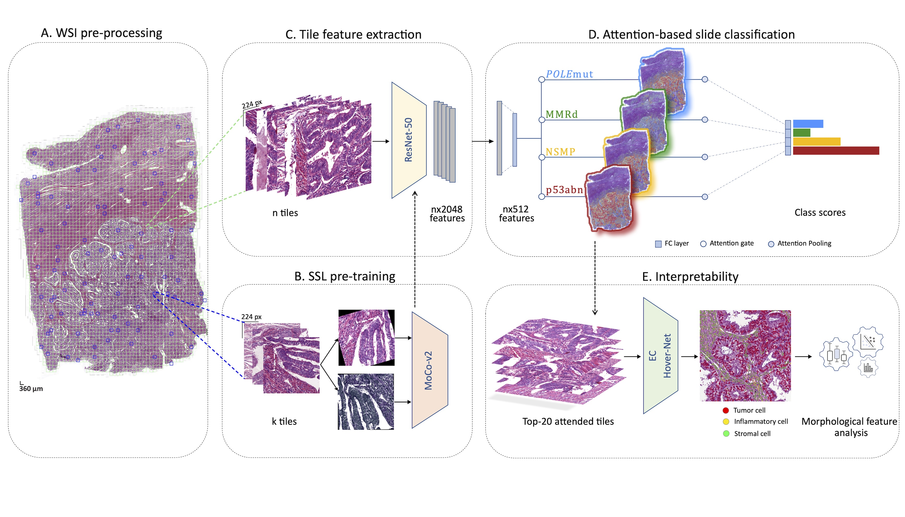

# im4MEC: Image-based prediction of the Molecular Endometrial Cancer classification 


Code for the **im4MEC** model described in the ([preprint](https://papers.ssrn.com/sol3/papers.cfm?abstract_id=4144537)) 'Interpretable deep learning model to predict the molecular classification of endometrial cancer from H&E whole slide images: a combined analysis of the PORTEC randomised trials and clinical cohorts' (**in press**).

im4MEC is a deep-learning model for slide-level molecular classification of Endometrial Cancer using the morphological features encoded in H&E whole slide images. It uses self-supervised learning (SSL) to get histopathology domain specific feature representation of tiles, followed by attention-mechanism to identify the tiles with morphological features of high importance towards molecular classification of the Whole Slide Image. im4MEC is interpretable and indentifies morpho-molecular correlates in endometrial cancer. 


*im4MEC pipeline*


# Install dependencies
Due to issues with OpenSlide dependencies ([like this one with pixman](https://github.com/mahmoodlab/CLAM/issues/13#issuecomment-690327553)) it is recommended to install the project's dependencies using the conda `environment.yml` rather than individually `pip install`-ing the dependencies.

The below command creates an unnamed conda environment in your working directory.

```sh
conda env create --prefix ./.conda -f environment.yml
conda activate ./.conda
```

# Self-supervised training of the feature extractor using MoCoV2
## Sample tiles from your dataset

The `sample_tiles.py` script needs to be executed for every WSI that you want to sample tiles from.  In this example, the output tiles images will be stored in `moco_tiles/train`. Additionally, one quality control (QC) image will be generated for each WSI so the user can evaluate the location of the sampled tiles. This QC image will be stored in `moco_tiles/QC` in the example.

```sh
python sample_tiles.py \
--input_slide /path/to/your/WSI.svs \
--output_dir moco_tiles \
--tile_size 360 \
--n 2048 \
--out_size 224
```

For example, if you have a list of absolute paths to your WSI files named `WSI_FILES.txt` and are working on Linux you can use the below command to run `sample_tiles.py` across all of them. This is a crude, non-parallel approach and we encourage users to create their own wrapper scripts instead to exploit the opportunities for parallelism of their hardware. The `sample_tiles.py` script does not require a GPU.

```bash
cat WSI_FILES.txt | xargs -I WSIFILE echo python sample_tiles.py --input_slide=WSIFILE --output_dir=moco_tiles --tile_size=360 --n=2048 --out_size=224 | bash
```

We encourage users to read the `sample_tiles.py` source code for more details of the sampling process and the command line arguments.


## Self-supervised training

This repository contains a fork of the [original MoCo codebase](https://github.com/facebookresearch/moco), with a few minor modifications:
- Added a cosine learning rate decay routine with warmup.
- Changed the image augmentation pipeline for improved results on HE WSI data.

After you have extracted the tiles that you want to use to train the feature extractor, you can invoke the MoCoV2 training routine using something like the command below. We encourage users to read the MoCo [README](/moco/README.md) and source code for more details on how to use it.

```sh
python moco/main_moco.py \
moco_tiles \
--lr 0.06 \
--warmup 10 \
--epochs 300 \
--cos \
--batch-size 288 \
--arch resnet50 \
--moco-k 73728 \
--moco-t 0.07 \
--mlp \
--dist-url 'tcp://localhost:10001' \
--multiprocessing-distributed \
--world-size 1 \
--rank 0
```


# Training the attention model
## Converting each WSI into a bag of feature vectors

Next, each WSI in the dataset needs to be converted into a bag of feature vectors using the feature extractor model that we trained in the previous step using self-supervised learning.

The below example command will use the trained feature extraction model to convert each tile in the WSI into a feature vector. All feature vectors of a WSI will be saved together in a 'feature bag' in the `.h5` file format. Additionally, a quality control image will be generated in the same output directory so the user can evaluate the quality of the tissue segmentation and tiling. Both output files will be named after the input WSI, suffixed with `*_features.h5` and `*_features_QC.png`, respectively.

```sh
python preprocess.py \
--input_slide /path/to/your/WSI.svs \
--output_dir feature_bags \
--tile_size 360 \
--out_size 224 \
--batch_size 256 \
--checkpoint /path/to/your/feature_extractor.pth.tar \
--backbone resnet50 \
--workers 4
```

Please refer to the code of the `preprocess.py` script for an explanation of the command line arguments.

Note that providing a weights checkpoint `--checkpoint` is optional. If you want to run this step using a feature extractor with ImageNet weights instead, you can use the `--imagenet` flag.

Note that this is a very compute-intensive script. While it can be run on the CPU, having a GPU available is advisable especially for larger datasets.

Creating feature bags for each WSI in your dataset is an 'embarassingly parallel' problem. Just like with the `sample_tiles.py` step, we encourage users to create their own wrapper scripts to exploit the potential for parallelism of their systems.

## Prepare your dataset
The structure of your experiment should be defined in a CSV file. See `labels.csv` for an example. This file should contain a single line for each WSI in your dataset.

- The `slide_id` is an arbitrary identifier for each slide.
- The `class` column refers to the WSI's class in the classification task
- The `label` column is the WSI's class but coded as an integer label for use under the hood in Pytorch.
- The `fold-0 ... fold-k` columns tell `train.py` whether the WSI should be part of the training or validation set during each fold of the cross validation routine. The number of `fold-*` columns should correspond to the number of folds you want to use in the k-fold cross validation routine. E.g. when you want _k = 6_ the columns `fold-0` through `fold-5` should be present.

## Training

To train the attention model that performs the final WSI-level classification, we use the `train.py` script. This script has a k-fold cross-validation routine built in. The below example command will run the training + validation loop for each set of hyperparameters hardcoded in the `main()` function of `train.py` and log the results to Tensorboard. Model checkpoints will not be saved. Note that the cross-validation routine can be parallized if you have the hardware for that by running multiple instances of `train.py` at a time.

```sh
for fold in 0 1 2 3
do
python train.py \
--manifest labels.csv \
--data_dir feature_bags \
--input_feature_size 2048 \
--fold ${fold}
done
```

Note that the `--input_feature_size` argument needs to correspond to the size of the feature vectors produced by the feature extractor model. Please refer to the code of the `train.py` script for an explanation of the other command line arguments.

Once you have established that a certain set of hyperparameters is optimal for your task, you can train the model on the entire training + validation by providing the index of the optimal set of hyperparameters to the `--full_training` argument. Model checkpoints will be saved in the `./runs` directory. The below example command will use the 3rd (index 2) set of hyperparameters.

```sh
python train.py \
--manifest labels.csv \
--data_dir feature_bags \
--input_feature_size 2048 \
--full_training 2
```

# Create attention heatmaps

Once you have a trained attention model, the `attention.py` script can be used to generate attention heatmaps for arbitrary WSIs. The below command will create one heatmap for each class in your classification task for the provided WSI. 

Note that this script is very resource intensive as it requires running the feature extraction model multiple times across the entire WSI. Using a GPU is advisable.

```sh
python attention.py \
--input_slide /path/to/your/WSI.svs \
--output_dir heatmaps \
--manifest labels.csv \
--encoder_checkpoint /path/to/your/feature_extractor.pth.tar \
--encoder_backbone resnet50 \
--attn_checkpoint runs/some_run/5_checkpoint.pt \
--attn_model_size small \
--input_feature_size 2048 \
--tile_size 360 \
--out_size 224 \
--overlap_factor 1 \
--display_level 3
```
